# Mix-Mode Backspace Bug Fix Context

## Decisions

**Fix: Move `lastInputChild` declaration before mutation processing**
- Rationale: Variable used in `removedNodes.forEach` (L1149) but was declared after mutations (L1158)
- Impact: Backspace after tag on new line failed silently - browser removed BR, but Tagify didn't sync state
- Approach: Declare `lastInputChild` at start of `onInputDOMChange` before processing mutations

## Code Changes

**File**: `src/parts/events.js`

**Before** (bug):
```javascript
onInputDOMChange(m){
    m.forEach(record => {
        record.removedNodes.forEach(removedNode => {
            if( removedNode && removedNode.nodeName == 'BR' && isNodeTag.call(this, lastInputChild)){
                // lastInputChild undefined here!
                this.removeTags(lastInputChild)
            }
        })
    })
    var lastInputChild = this.DOM.input.lastChild; // L1158 - too late!
}
```

**After** (fixed):
```javascript
onInputDOMChange(m){
    var lastInputChild = this.DOM.input.lastChild; // L1094 - moved before mutations

    m.forEach(record => {
        record.removedNodes.forEach(removedNode => {
            if( removedNode && removedNode.nodeName == 'BR' && isNodeTag.call(this, lastInputChild)){
                this.removeTags(lastInputChild) // now works
            }
        })
    })
}
```

## Domain Model

**Mix-Mode DOM Mutation Flow**:
```
User Action (Backspace)
  ↓
Browser native contenteditable removes node
  ↓
MutationObserver detects change
  ↓
onInputDOMChange(m) callback
  ├─ Process addedNodes (tags, BRs, divs)
  ├─ Process removedNodes (BR removal triggers tag cleanup)
  └─ Ensure last child is BR
```

**Key Entities**:
- `this.DOM.input`: contenteditable element containing tags + text
- `lastInputChild`: last DOM node before mutations (used to detect tag after BR removal)
- `removedNode`: BR element removed by browser when backspacing after tag on new line
- `isNodeTag`: helper to check if node is a Tagify tag element

**Constraints**:
- Mix-mode uses MutationObserver (L82-84) to detect DOM changes
- Browser handles actual DOM removal (not Tagify code)
- Tagify must sync internal state (`this.value`) after browser mutations
- Last child must always be `<BR>` for caret positioning

## Deletion Flow in Mix-Mode

**Entry Point**: `onKeydown()` handler (L346) → Mix-mode switch (L366) → Backspace/Delete case (L377)

### Deletion Scenarios

**Scenario 1: Chrome Android - Direct Removal**
- **Trigger**: `isChromeAndroidBrowser() && isCaretAfterTag instanceof Element`
- **Location**: `src/parts/events.js:L399-414`
- **Flow**:
  - Directly calls `isCaretAfterTag.remove()` (L403)
  - Regains focus (Android Chrome bug workaround)
  - Places caret after previous text node
- **Note**: Only browser-specific path that explicitly removes tag via Tagify code

**Scenario 2: Backspace = 'edit' Mode**
- **Trigger**: `_s.backspace == 'edit' && isCaretAfterTag`
- **Location**: `src/parts/events.js:L392-396`
- **Flow**:
  - Enters edit mode instead of deleting
  - Prevents default browser behavior
  - Returns early (no deletion)
- **Purpose**: User preference to edit tags rather than delete them

**Scenario 3: Delete Key with Zero-Width Space**
- **Trigger**: `e.key == 'Delete' && isZWS && getSetTagData(sel.anchorNode.nextSibling)`
- **Location**: `src/parts/events.js:L461-463`
- **Flow**:
  - Explicitly calls `this.removeTags(sel.anchorNode.nextSibling)`
  - Tagify handles removal (not browser)
- **Note**: Only explicit Tagify removal path in mix-mode

**Scenario 4: Browser Native Deletion (Most Common)**
- **Trigger**: Default behavior - browser removes node via contenteditable
- **Location**: Browser native implementation
- **Flow**:
  1. User presses Backspace/Delete
  2. Browser removes tag element from DOM (no Tagify code involved)
  3. MutationObserver detects `childList` change
  4. `onInputDOMChange()` callback fires (L1092)
  5. Processes `removedNodes` array
  6. If BR removed + last child is tag → calls `removeTags()` (L1149-1150)
  7. Otherwise, browser deletion stands, Tagify syncs state via `update()`
- **Key Point**: Tagify doesn't prevent deletion, only syncs state after

**Scenario 5: BR Removal After Tag on New Line**
- **Trigger**: `removedNode.nodeName == 'BR' && isNodeTag.call(this, lastInputChild)`
- **Location**: `src/parts/events.js:L1147-1152`
- **Flow**:
  1. User presses Backspace after tag on new line
  2. Browser removes `<BR>` element first
  3. MutationObserver detects BR removal
  4. `onInputDOMChange` checks if last child is a tag
  5. Calls `this.removeTags(lastInputChild)` to sync state
  6. Calls `fixFirefoxLastTagNoCaret()` for Firefox
- **Bug Fix**: This is where `lastInputChild` must be defined before mutations

### Deletion Detection Logic

**Variables computed in Backspace handler** (L380-390):
- `deleteKeyTagDetected`: Delete key at end of text node
- `isCaretAfterTag`: Caret positioned after a tag element
- `tagElmToBeDeleted`: Candidate tag for deletion (computed but may not be used)
- `isZWS`: Zero-width space character detected

**Key Conditions**:
- `sel.anchorNode.nodeName == 'BR'` → Early return, no action (L417)
- `!sel.anchorOffset && sel.anchorNode == this.DOM.input` → Prevent deletion at start (L448)
- `tagElmToBeDeleted.hasAttribute('readonly')` → Skip readonly tags, move caret (L453)
- `!_s.backspace` → Prevent deletion if disabled (L443)

### removeTags() Method Flow

**Location**: `src/tagify.js:L1665-1770`

**Steps**:
1. Normalize input (HTMLElement/Array/String → Array of tag objects)
2. Filter readonly tags
3. Call `beforeRemoveTag` hook (Promise-based)
4. Update state: `removeTagsFromValue()` → removes from `this.value` array
5. Call `update()` → syncs original input element value
6. Remove DOM node:
   - If `tranDuration > 10`: Animate removal → `removeNode()` after delay
   - Else: Immediate `removeNode()` → `parentNode.removeChild(tag.node)` (L1722)
7. Trigger `remove` event
8. Refilter dropdown suggestions

**Critical Order**: State updated BEFORE DOM removal (L1755-1756 before L1767)

## Unresolved

**Edge Cases**:
- What if multiple BRs removed simultaneously?
- Behavior when tag is readonly but BR is removed?
- Firefox-specific handling (`fixFirefoxLastTagNoCaret` called but not examined)

**Questions**:
- Why check `removedNode.nodeName == 'BR'` specifically? What if tag removed directly?
  - **Answer**: In mix-mode, when caret is after tag on new line, browser removes BR first. Tag removal happens separately or browser handles it. BR removal is the signal that tag deletion is in progress.
- Should `lastInputChild` be recalculated after each mutation record?
  - **Answer**: No - it captures state BEFORE mutations, which is needed to detect "was last child a tag before BR was removed"

**Key Insights**:
- **Most deletions are browser-native**: Tagify doesn't intercept, only syncs state afterwards
- **Only 2 explicit removal paths**: Chrome Android (L403) and Delete+ZWS (L462)
- **BR removal is the trigger**: When BR removed + last child is tag → Tagify syncs via `removeTags()`
- **State sync happens AFTER DOM removal**: `removeTags()` updates `this.value` then removes DOM node
- **MutationObserver is reactive**: Detects changes after browser acts, doesn't prevent them

## Dependencies

```
onInputDOMChange
  ├─ depends on: MutationObserver (bound in binding(), L76-84)
  ├─ calls: removeTags() → updates this.value
  ├─ calls: fixFirefoxLastTagNoCaret() → Firefox caret fix
  ├─ uses: isNodeTag (helpers.js)
  └─ uses: placeCaretAfterNode (helpers.js)
```

**MutationObserver Setup**:
- Bound only in mix-mode: `if( _s.mode == 'mix' )` (L82)
- Observes: `{childList:true}` - detects added/removed nodes
- Callback: `_CB.onInputDOMChange.bind(this)`

## Deletion Flow Diagram

```mermaid
flowchart TD
    Start[User Presses Backspace/Delete] --> CheckMode{Mode == 'mix'?}
    CheckMode -->|No| NormalMode[Normal Mode Handler<br/>L500-512]
    CheckMode -->|Yes| MixMode[Mix-Mode Handler<br/>L377-479]

    MixMode --> CheckEditing{state.editing?}
    CheckEditing -->|Yes| ReturnEarly[Return Early<br/>L378]
    CheckEditing -->|No| CheckBackspaceEdit{backspace == 'edit'?}

    CheckBackspaceEdit -->|Yes & isCaretAfterTag| EnterEditMode[Enter Edit Mode<br/>L392-396<br/>preventDefault + return]
    CheckBackspaceEdit -->|No| CheckChromeAndroid{Chrome Android?}

    CheckChromeAndroid -->|Yes & isCaretAfterTag| ChromeAndroidRemove[Direct Remove<br/>L399-414<br/>isCaretAfterTag.remove<br/>Regain focus]
    CheckChromeAndroid -->|No| CheckBR{anchorNode == BR?}

    CheckBR -->|Yes| ReturnEarly2[Return Early<br/>L417]
    CheckBR -->|No| ComputeTag[Compute tagElmToBeDeleted<br/>L420-433]

    ComputeTag --> CheckReadonly{tag readonly?}
    CheckReadonly -->|Yes| MoveCaret[Move Caret After Tag<br/>L453-458<br/>return]
    CheckReadonly -->|No| CheckZWS{Delete + ZWS?}

    CheckZWS -->|Yes| ExplicitRemove[Explicit removeTags<br/>L461-463<br/>removeTags nextSibling]
    CheckZWS -->|No| CheckBackspaceSetting{backspace allowed?}

    CheckBackspaceSetting -->|No| PreventDefault[preventDefault<br/>L443-445<br/>return]
    CheckBackspaceSetting -->|Yes| BrowserNative[Browser Native Deletion<br/>No Tagify Code]

    BrowserNative --> BrowserRemoves[Browser Removes Tag<br/>from DOM]
    BrowserRemoves --> MutationObserver[MutationObserver<br/>Detects Change<br/>L76-84]

    MutationObserver --> OnInputDOMChange[onInputDOMChange<br/>L1092]
    OnInputDOMChange --> GetLastChild[Get lastInputChild<br/>L1094]
    OnInputDOMChange --> ProcessAdded[Process addedNodes<br/>L1099-1144]
    OnInputDOMChange --> ProcessRemoved[Process removedNodes<br/>L1147-1153]

    ProcessRemoved --> CheckBRRemoved{BR removed<br/>& lastChild is tag?}
    CheckBRRemoved -->|Yes| CallRemoveTags[removeTags lastInputChild<br/>L1150]
    CheckBRRemoved -->|No| BrowserDeletionStands[Browser Deletion Stands<br/>State synced via update]

    ExplicitRemove --> RemoveTagsMethod[removeTags Method<br/>L1665]
    CallRemoveTags --> RemoveTagsMethod

    RemoveTagsMethod --> NormalizeInput[Normalize Input<br/>L1669-1675]
    NormalizeInput --> FilterReadonly[Filter Readonly<br/>L1688]
    FilterReadonly --> BeforeRemoveHook[beforeRemoveTag Hook<br/>L1717]
    BeforeRemoveHook --> UpdateState[Update State<br/>removeTagsFromValue<br/>L1755]
    UpdateState --> UpdateInput[Update Original Input<br/>update L1756]
    UpdateInput --> RemoveDOM{Animation?}

    RemoveDOM -->|Yes tranDuration > 10| Animate[Animate Removal<br/>L1744-1750<br/>setTimeout]
    RemoveDOM -->|No| ImmediateRemove[Immediate Remove<br/>L1767<br/>parentNode.removeChild]

    Animate --> RemoveNode[removeNode Function<br/>L1719-1742]
    ImmediateRemove --> RemoveNode

    RemoveNode --> RemoveFromDOM[parentNode.removeChild tag.node<br/>L1722]
    RemoveFromDOM --> TriggerEvent[Trigger 'remove' Event<br/>L1738]
    TriggerEvent --> RefilterDropdown[Refilter Dropdown<br/>L1726]

    style BrowserNative fill:#ffcccc
    style BrowserRemoves fill:#ffcccc
    style MutationObserver fill:#ccffcc
    style OnInputDOMChange fill:#ccffcc
    style RemoveTagsMethod fill:#ccccff
    style RemoveFromDOM fill:#ffffcc
```



## Graph

```yaml
nodes:
  - MutationObserver
  - onInputDOMChange
  - removeTags
  - DOM.input (contenteditable)

edges:
  - [MutationObserver, onInputDOMChange, {type: triggers, condition: "childList changes"}]
  - [onInputDOMChange, removeTags, {type: calls, condition: "BR removed && lastInputChild is tag"}]
  - [Browser, DOM.input, {type: mutates, note: "native contenteditable behavior"}]
```
