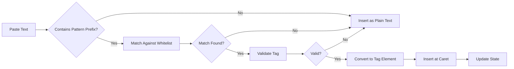
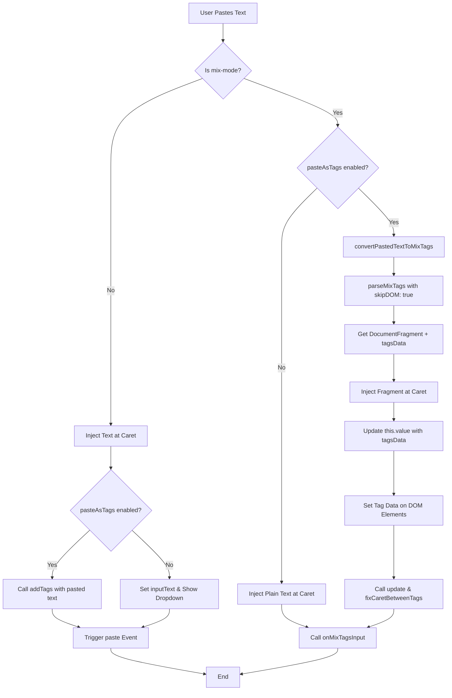
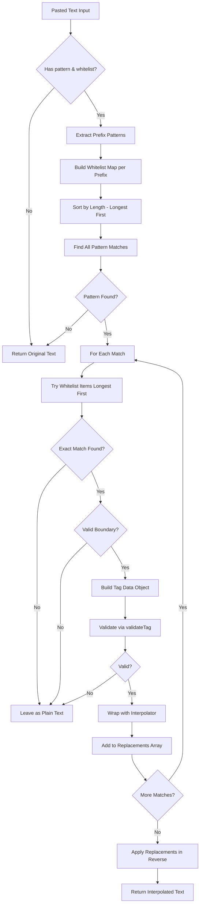
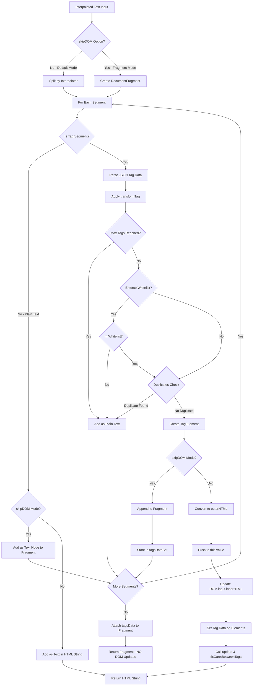
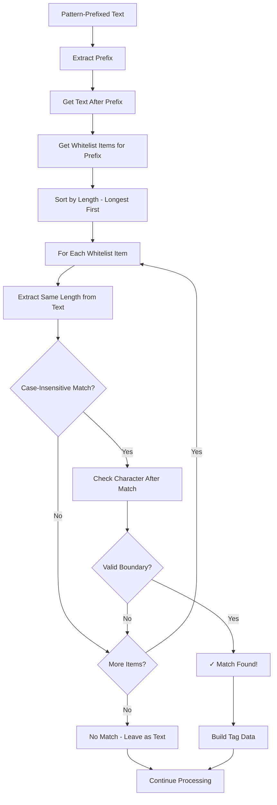

# Paste As Tags in Mix-Mode

## Overview

When `pasteAsTags: true` is set in mix-mode, pasted text containing pattern-prefixed words (e.g., `@username`, `#hashtag`) will be automatically converted into tags if they match items in the whitelist.

### High-Level Flow



## How It Works

### Pattern Detection
The implementation scans pasted text for words that:
1. Start with a prefix defined in the `pattern` setting (e.g., `@` or `#`)
2. Continue until a delimiter/boundary character (defined by `mixTagsAllowedAfter`)
3. Match an item in the current `whitelist` (case-insensitive)

### Example

**Settings:**
```javascript
{
  mode: 'mix',
  pattern: /@/,
  pasteAsTags: true,
  tagTextProp: 'value',  // Default: matches against 'value' property
  whitelist: [
    {value: "cartman", title: "Eric Cartman"},
    {value: "kyle", title: "Kyle Broflovski"},
    {value: "butters", title: "Butters Stotch"}
  ]
}
```

**Pasted text:**
```
"Hello @cartman and @kyle, but not @invalid"
```

**Result:**
```
"Hello [[{"value":"cartman","title":"Eric Cartman","prefix":"@"}]] and [[{"value":"kyle","title":"Kyle Broflovski","prefix":"@"}]], but not @invalid"
```

**Note:** If `tagTextProp` is set to `'text'` and whitelist items have a `text` property, matching will use that property instead of `value`.

## Flow Diagrams

### Main Paste Flow



### Text-to-Tags Conversion Flow (`convertPastedTextToMixTags`)



### Tag Parsing Flow (`parseMixTags`)



### Matching Logic Flow



## Key Behaviors

### 1. Exact Whitelist Matching
- Only creates tags for **exact matches** from the whitelist
- If `@testing123` is pasted and whitelist only has `"testing"`, no tag is created
- Partial matches are **not** supported

### 2. Case-Insensitive Matching
- `@Cartman`, `@cartman`, `@CARTMAN` all match whitelist item `"cartman"`
- The whitelist's original value is used in the created tag
- Matching uses the `tagTextProp` setting (default: `'value'`) to determine which property to match against

### 3. Longest Match First
- Whitelist items are sorted by length (longest first)
- If whitelist has `["test", "test data", "testing"]`
- Pasting `@test data` will match `"test data"` (not just `"test"`)

### 4. Multiple Patterns
When using multiple patterns (e.g., `/@|#/`):
- All patterns are processed
- Each can have its own effective whitelist
- Tags are created with the appropriate prefix

Example:
```javascript
pattern: /@|#/,
whitelist: [...] // Can dynamically change based on prefix (see test/mix.html)
```

### 5. Boundary Detection
The `mixTagsAllowedAfter` setting (default: `/,|\.|\:|\s/`) defines valid characters that can appear **immediately after** a tag match:

**How it works:**
1. Match is found by comparing text segment with whitelist item
2. Check the character **immediately following** the matched text
3. If character is a valid boundary (or end of string), match is accepted
4. If character is not a valid boundary, match is rejected

**Examples:**
- `@cartman.test` → matches `@cartman` (`.` after match is a valid boundary)
- `@kyle, @stan` → matches both (`,` and space are valid boundaries)
- `@butters:hello` → matches `@butters` (`:` after match is a valid boundary)
- `@cartmanX` → does NOT match `@cartman` (`X` is not a valid boundary)

### 6. Validation

Tag validation happens in **two stages**:

**Stage 1: Initial Validation** (in `convertPastedTextToMixTags`):
- Validates via `validateTag()` method which checks:
  - Custom `validate` function (if defined)
  - `pattern` setting (if defined)
  - Other custom validation logic
- Invalid matches are left as plain text (not wrapped with interpolator)

**Stage 2: Final Validation** (in `parseMixTags`):
- Checks `enforceWhitelist` setting
- Checks `duplicates` setting (if `duplicates: false`)
- Checks `maxTags` limit
- Invalid tags are added as plain text with interpolator preserved

**Why Two Stages?**
- Stage 1 filters out obviously invalid tags before creating interpolated format
- Stage 2 ensures tags meet all requirements before being added to DOM/state
- This prevents unnecessary processing of invalid tags

### 7. Non-Matches Preserved
Text that doesn't match is left unchanged:
- `@invalid` → stays as `@invalid` (plain text)
- `no prefix here` → stays as is
- Mixed content is preserved: `"@cartman is here"` → `"[[...]] is here"`

## Implementation Details

### Main Methods

**`convertPastedTextToMixTags(text)`** - Located in `src/tagify.js`:

Converts pasted text into interpolated format by detecting pattern-prefixed words that match whitelist items:

1. **Extracts prefix patterns** from the `pattern` setting (e.g., `/@|#/` → `['@', '#']`)
2. **Builds whitelist mappings** per prefix, sorted by length (longest first)
3. **Scans text** for pattern-prefixed words using regex
4. **Matches against whitelist** (case-insensitive, longest match wins)
5. **Validates each match** through `validateTag()` method
6. **Wraps valid matches** with `mixTagsInterpolator` (`[[...]]`)
7. **Returns interpolated text** with invalid matches preserved as plain text

**`parseMixTags(text, options)`** - Located in `src/tagify.js`:

Parses interpolated text (e.g., `"text [[{"value":"tag"}]] more text"`) into tag elements. This method supports two modes via the `options` parameter:

- **Default mode** (`options` omitted or `{ skipDOM: false }`):
  - Updates `DOM.input.innerHTML` directly
  - Pushes tags to `this.value` array
  - Used for initial value loading (`loadOriginalValues()`)

- **Fragment mode** (`{ skipDOM: true }`):
  - Returns a `DocumentFragment` containing text nodes and tag elements
  - Does NOT modify `DOM.input` or `this.value` (returns early)
  - Does NOT call `update()` or `fixCaretBetweenTags()`
  - Attaches `__tagifyTagsData` array to fragment for later processing
  - Used for paste insertion and other dynamic tag creation
  - **Important**: DOM updates and state management must be handled by the caller (e.g., `onPaste` handler)

**Key Features:**
- Handles duplicate detection based on `duplicates` setting
- Respects `enforceWhitelist` and `maxTags` settings
- Applies `transformTag` callback if defined
- Validates tags through existing validation pipeline

**Return Values:**
- **Default mode**: Returns HTML string (the processed `innerHTML`)
- **Fragment mode** (`skipDOM: true`): Returns `DocumentFragment` with `__tagifyTagsData` property attached

### Integration Point: `onPaste` Event

Located in `src/parts/events.js`:

**Note:** This code uses helper functions imported from `src/parts/helpers.js`:
- `getSetTagData` - Sets/gets tag data on DOM elements
- `fixCaretBetweenTags` - Ensures proper caret positioning between tags
- `injectAtCaret` - Injects content at current caret position

```javascript
if( this.settings.mode == 'mix' ){
    if( this.settings.pasteAsTags ){
        // Step 1: Convert pasted text to interpolated format
        const interpolatedText = this.convertPastedTextToMixTags(result)

        // Step 2: Parse into DocumentFragment (skipDOM mode)
        // Note: This returns early without updating DOM or this.value
        const fragment = this.parseMixTags(interpolatedText, { skipDOM: true })
        const tagsData = fragment.__tagifyTagsData || []

        // Step 3: Inject fragment at caret position
        this.injectAtCaret(fragment, window.getSelection().getRangeAt(0))

        // Step 4: Update internal state
        // Note: duplicates already filtered by parseMixTags
        tagsData.forEach(tagData => this.value.push(tagData))

        // Step 5: Set tag data on DOM elements and update
        const addedTags = this.getTagElms().slice(-tagsData.length)
        addedTags.forEach((elm, idx) => getSetTagData(elm, tagsData[idx]))
        this.update()
        fixCaretBetweenTags(addedTags)
    }
    else {
        this.injectAtCaret(result, window.getSelection().getRangeAt(0))
    }

    this.events.callbacks.onMixTagsInput.call(this, e);
}
```

**The Complete Flow:**

1. **User pastes text** → `onPaste` event handler triggered
2. **If `pasteAsTags` is enabled**:
   - **Stage 1 - Conversion**: Convert pattern-prefixed text to interpolated format (`convertPastedTextToMixTags`)
     - Scans text for pattern prefixes
     - Matches against whitelist (longest match first)
     - Validates via `validateTag()` (Stage 1 validation)
     - Wraps valid matches with `mixTagsInterpolator`
   - **Stage 2 - Parsing**: Parse interpolated text into a `DocumentFragment` (`parseMixTags` with `skipDOM: true`)
     - Parses JSON tag data from interpolator format
     - Validates `enforceWhitelist`, `duplicates`, `maxTags` (Stage 2 validation)
     - Creates tag DOM elements
     - Returns fragment with `__tagifyTagsData` attached (NO DOM updates)
   - **Stage 3 - Injection**: Inject fragment at current caret position
   - **Stage 4 - State Update**: Update `this.value` array with new tag data (duplicates already filtered by Stage 2)
   - **Stage 5 - DOM Sync**: Set tag data on DOM elements and call `update()`
   - **Stage 6 - Caret Fix**: Fix caret positioning between tags
3. **If `pasteAsTags` is disabled**:
   - Inject pasted text as plain text at caret
4. **Call `onMixTagsInput`** callback for any additional processing

## Testing

Run `test/mix.html` and click the **"Test pasteAsTags"** button to see the feature in action.

The test will simulate pasting: `"@cartman @Mr. Garrison @invalid text @butters"`

Expected result:
- `@cartman` → converted to tag
- `@Mr. Garrison` → converted to tag (matches whitelist item with period)
- `@invalid` → left as plain text (not in whitelist)
- `text` → preserved as is
- `@butters` → converted to tag

## Edge Cases Handled

1. ✅ Empty whitelist → no conversion (returns original text)
2. ✅ No pattern defined → no conversion
3. ✅ Pattern without matches → text unchanged
4. ✅ Multiple patterns with dynamic whitelists → each processed
5. ✅ Overlapping potential matches → longest match wins
6. ✅ Case variations → matched correctly
7. ✅ Validation failures → left as plain text
8. ✅ Full whitelist metadata → included in tag data
9. ✅ Duplicate tags → automatically filtered based on `duplicates` setting
10. ✅ Max tags limit → respected via `maxTags` setting
11. ✅ Whitelist enforcement → validated via `enforceWhitelist` setting

## Configuration Example

```javascript
var tagify = new Tagify(textarea, {
    mode: 'mix',
    pattern: /@|#/,
    pasteAsTags: true,  // Enable auto-conversion on paste
    whitelist: [
        {value: "user1", name: "John Doe"},
        {value: "user2", name: "Jane Smith"},
        {value: "hashtag1"},
        {value: "hashtag2"}
    ],
    mixTagsAllowedAfter: /,|\.|\:|\s/,  // Tag boundaries
    dropdown: {
        enabled: 1,
        position: 'text'
    }
})
```

## Performance Notes

- Whitelist sorting happens once per paste (negligible for typical list sizes)
- Regex matching is efficient (single pass, left-to-right)
- For very large whitelists (10,000+ items), consider lazy loading or filtering

## Architecture Notes

### DRY Principle

The implementation follows DRY (Don't Repeat Yourself) principles:

- **Single parsing method**: `parseMixTags()` handles both initial value loading and paste insertion via the `skipDOM` option, eliminating code duplication
- **Reuses existing validation**: All tag validation goes through the standard `validateTag()` pipeline
- **Leverages existing tag creation**: Uses `createTagElem()` to ensure consistent tag rendering

### Method Consolidation

Previously, there were two separate methods:
- `parseMixTags()` - for initial value loading
- `parseInterpolatedTextToFragment()` - for paste insertion

These have been consolidated into a single `parseMixTags(text, options)` method that handles both use cases, reducing code duplication and maintenance burden.

## See Also

- `mixTagsAllowedAfter` setting (defines tag boundaries)
- `mixTagsInterpolator` setting (tag format: default `['[[', ']]']`)
- `pattern` setting (defines tag prefixes)
- `validateTag` method (validation process)
- `parseMixTags` method (parses interpolated text into tags)
- `createTagElem` method (creates tag DOM elements)
