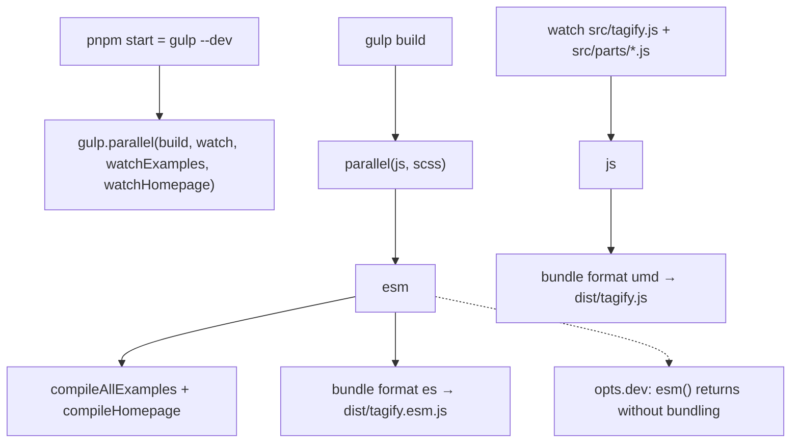

# Rollup 2.80.0 → 3.29.4 → 4

Guide: [Migrating to Rollup 4](https://rollupjs.org/migration/) (the same page has "Migrating to Rollup 3"). This repo does not use a `rollup.config.js`. The entire Rollup surface is `bundle()` in [gulpfile.js](gulpfile.js).

Do the majors one at a time. Stay on 3.29.4 until the verification gate passes. Rollup is a devDependency; the published contract is `dist/tagify.js` (UMD, global `Tagify`) and `dist/tagify.esm.js` (`export { … as default }`).

## What the gulp pipeline actually does



`bundle()` today:

1. Plugins, in order: `rollup-plugin-swc3` (transform), `@rollup/plugin-terser` only when `--dev` is absent (`renderChunk`), `rollup-plugin-banner2` (`renderChunk`, prepends the license, returns a MagicString map).
2. `@rollup/stream` calls `require('rollup')`, then `rollup(options)` with `output` nested on the same object, then `bundle.generate(options.output)`. It pushes `chunk.code` and, when `chunk.map` exists, a second string `` `//# sourceMappingURL=${chunk.map.toUrl()}` ``. It never emits a separate map file and it never calls `bundle.close()`.
3. `vinyl-source-stream(outputName)` names the file `tagify.js` or `tagify.esm.js` in `process.cwd()`, not under `dist/`.
4. `buffer()`, then `gulp-sourcemaps.init({ loadMaps: true })`, then `sourcemaps.write('./')`, then `gulp.dest('./dist')`.

That order is why the committed maps look the way they do. Rebase happens while the vinyl path is still `<cwd>/tagify.js`. `write('./')` then emits a sibling map. `gulp.dest` moves both into `dist/`. Result today:

| Field | `dist/tagify.js.map` and `dist/tagify.esm.js.map` |
|---|---|
| `file` | `tagify.js` / `tagify.esm.js` |
| `sources` | 11 paths, forward slashes, repo-root relative: `src/parts/constants.js` … `src/tagify.js` … `src/parts/EventDispatcher.js`. Not `../src/…`. Not absolute. |
| `sourcesContent` | present for every source |
| `names` | hundreds (minified prod build) |
| extra key | `preExistingComment` (gulp-sourcemaps artifact; allowed to disappear) |
| JS comment | exactly one trailing `//# sourceMappingURL=<basename>.map` |
| JS head | one license comment starting `/*` + `Tagify v…` (banner2 formatter is `identity`, so the `/* */` in the gulp banner is not wrapped again) |

Playwright loads the UMD file: [docs/examples/src/example-template.html](docs/examples/src/example-template.html) line 13 is `../../../dist/tagify.js`. `pnpm test` does not check the ESM file or the maps.

`scss`, examples, and the homepage do not call Rollup. `compileHomepage` already dynamic-imports an ESM-only gulp plugin. That is the pattern to copy if `require('rollup')` fails.

## Invariants

Preserve through both majors:

- Prod `gulp build` writes `dist/tagify.js` and `dist/tagify.esm.js` plus the two `.map` files.
- Node loads the UMD file as CJS. Measured on the current prod bundle: `require('./dist/tagify.js')` is a function, and `global.Tagify` stays `undefined`. The wrapper's first branch is `module.exports=e()` whenever `module` exists, so a `global.Tagify` check fails on Rollup 2.80.0 and is not the gate. The browser global is Playwright's job (`example-template.html` loads `dist/tagify.js`).
- ESM file contains `as default` and does not contain `module.exports`.
- Map `sources` stay the same 11 forward-slash paths. `sourcesContent` stays populated. One relative `sourceMappingURL`. License comment stays a single leading block, ahead of the code.
- Mapping, measured on current prod `dist/tagify.js` and `dist/tagify.esm.js`: the first `[Tagify]` maps to `src/parts/helpers.js` line 5 (`console.log('[Tagify]:'`). The generated line that contains `Permission is hereby granted` has no source mapping. `removeTag` is the wrong token: the first hit is `removeTags` and maps to `src/parts/suggestions.js` line 173. Do not add a `source-map` dependency; `require.resolve('source-map')` fails in this repo. Decode the VLQ segment for that generated column (script in step 0). Same original file and line for a `--dev` UMD build. Generated column will differ and is not an invariant. Terser is not what pins line 5: both current prod files already hit line 5 at different generated columns.
- `--dev` still skips terser and skips the ESM bundle. Watch still rebuilds only `js`.
- `dist/tagify.css`, `dist/tagify.vue`, and the React wrapper stay untouched. React is served as source (`package.json` exports). The `react()` and `jquery()` functions in the gulpfile are not part of `build`.
- Prod byte size stays between 50% and 200% of the step 0 sizes, inclusive. Missing license text is a failure even inside that band.

Cosmetic output drift is expected and allowed: helper `var`/`const`, whitespace, mangled names, other mapping text, loss of `preExistingComment`. Empty `mappings`, missing `sourcesContent`, `[Tagify]` mapped anywhere but `src/parts/helpers.js` line 5, or a mapped license line, is a failed upgrade.

## Edge cases in this gulp setup

Each one can look like a green build or a sourcemap-only failure. Check them explicitly.

### 1. Errors are swallowed, and completion is signaled twice

```203:206:gulpfile.js
function handleError(err) {
    console.log( err.toString() );
    this.emit('end');
}
```

The handler sits on `buffer()`, not on the rollup stream. `pipe()` does not forward errors. A throw inside `@rollup/stream` (`toUrl`, native binding, bad cache) can miss this handler.

`emit('end')` turns a failure into a finished stream. `js()` also does `.on('end', done)` while returning that same stream. Gulp then sees success. `gulp.series` continues into `esm` and the docs tasks. `pnpm start` keeps watching.

Fix this on 2.80.0 before bumping Rollup. Otherwise the v3 spike can "pass".

- Use `stream.pipeline` (or listen for `error` on the rollup stream itself) so any stage fails the task.
- Return the stream and stop also calling `done` on `end`, except for the `--dev` ESM short-circuit, which must still call `done()` because it returns no stream.
- Prove one-shot failure: temporarily break `src/tagify.js`, run `gulp js`, expect non-zero. Restore the file.
- Prove the watcher separately. Do not assume Gulp 5 keeps `pnpm start` alive after the swallow is gone. With `pnpm start` running, save the same syntax error, then save the restored file. The process must still be running and the restored save must update `dist/tagify.js`. If the process dies, add an `error` listener on the watcher that logs and does not rethrow, then repeat this proof. That listener is not part of the edit until this proof fails.

### 2. The cache object is the wrong shape, and both formats share it

```188:190:gulpfile.js
.on('bundle', function(bundle) {
    rollupCache[entry] = bundle;
})
```

`@rollup/stream` emits the object returned by `rollup()`. Rollup reads `options.cache.modules` ([rollup 2.80.0](node_modules/rollup/dist/shared/rollup.js)). The gulp handler stores that object. `.modules` is on `bundle.cache`, not on the bundle. Passing it through is either ignored or, on Rollup 3, a throw.

Delete the `cache:` option and the `'bundle'` handler. Do not store `bundle.cache`. Do not add a single-flight flag. `exports.default` is `gulp.parallel(build, watch, …)`, so a save during the first `js` can overlap another `bundle()` on the same entry. A real cache is mutable. Turning the no-op into a working cache makes that overlap a corrupt build. A slower watch is acceptable. A correct cold build is the upgrade.

Do not call `bundle.close()` in this upgrade. Nothing reads `.cache` after the delete, and closing before `generate()` finishes throws "Bundle is already closed".

### 3. Sourcemaps are a two-step rewrite that v3/v4 already broke

The gulpfile comment at the `sourcemaps.init` line records a failed attempt on Rollup 3 and 4. Do not ignore it and do not "fix" it by deleting maps.

`@rollup/stream` 3.0.1 (peer range includes Rollup 2, 3, and 4) always calls `chunk.map.toUrl()`. Rollup 2 implements `toUrl()` on its `SourceMap` class. Rollup 4's type still declares `toUrl()` / `toString()`. The likely failure on this machine is the map gulp-sourcemaps rebases, not a missing method: Windows absolute paths, `sources` of `../src/…`, or a `file` field gulp-sourcemaps resolves against `<cwd>/tagify.js`.

Spike on 3.29.4. Before `sourcemaps.init`, temporarily log the map that is actually in the buffered file (last `sourceMappingURL`, decode a `data:` URL, print `file` and `sources`). The `'bundle'` event fires before `generate()`, so it does not have `chunk.map`. Remove the log after the table below is filled. If the stream throws before a file exists, the error text is the row. Classify:

| Spike result | Smallest fix |
|---|---|
| `chunk.map.toUrl is not a function`, or `require('rollup')` throws `ERR_REQUIRE_ESM` | Replace `@rollup/stream` with a local helper. Dynamic `import('rollup')` from the CJS gulpfile, same pattern as `compileHomepage`. `generate()` one chunk. Fail if `output.length !== 1` (this build has one input and no code-splitting; the stream currently concatenates extra chunks into the JS). |
| Build succeeds, map `sources` are absolute, backslash, or `../src/…` | One rebase only. Either keep gulp-sourcemaps and do not also set `sourcemapPathTransform`, or drop gulp-sourcemaps and set `sourcemapPathTransform` to the repo-root `src/…` form. Doing both double-prefixes paths. |
| gulp-sourcemaps throws | Stop using it for JS. Write two vinyl files: the JS (comment already pointing at `tagify.js.map`) and the map JSON. `gulp.dest('./dist')` writes both. |
| `output` inside `rollup()` is rejected | `@rollup/stream` passes the whole options object, including `output`, into `rollup()` and also into `generate()`. Split them in the local helper. |

Preserve the vinyl path accident unless you take over path logic yourself: sourcemap rebase runs before `gulp.dest`, while the file is still `<cwd>/<outputName>`. Moving `sourcemaps.write` to after `dest`, or setting `output.file` to `dist/tagify.js`, changes `sources` to `../src/…` or to absolute Windows paths. Published maps must stay `src/…` with `/` separators so they match today's `sourcesContent` layout.

`sourcemap: 'hidden'` drops the comment. Do not use it. `sourcemapExcludeSources` drops `sourcesContent`. Do not set it.

### 4. `output.name` on the ESM bundle

`name: 'Tagify'` is required for UMD and ignored for `format: 'es'`. `strictDeprecations` can fail the ESM build on that warning. Pass `name` only when `format === 'umd'`.

### 5. Plugin order and the license

Order is SWC, then terser (prod), then banner2. Banner2's default formatter is `identity`, and the gulp callback already supplies `/* … */`. A Rollup 3 `renderChunk` reorder would minify the license away or wrap it twice. After each major, the prod file must start with `/*`, contain `Permission is hereby granted`, and end with the sourceMappingURL line. Nothing else may prepend a banner.

`exports.patch`, `exports.feature`, and `exports.release` run `addBanner()`, which pipes `dist/*.js` through `gulp-header-comment`. That prepends a second banner and shifts mappings without updating them. Do not run those tasks to verify this upgrade.

### 6. `--dev` vs prod are different bundles

| | `pnpm start` (`gulp --dev`) | `gulp build` / `gulp js` + `gulp esm` |
|---|---|---|
| terser | off | on |
| ESM | `esm()` returns immediately | built |
| watch | rebuilds `js` only | n/a |
| map | unminified, still must have `sources` + `sourcesContent` | minified, `names` length must stay large |

Verify both. Playwright and the size check use the prod UMD file. Restart `pnpm start` after the install so the watch process is not still on Rollup 2.

### 7. Rollup 4 native binding takes down every gulp task

Rollup 4 loads `@rollup/rollup-win32-x64-msvc` (this machine). `@rollup/stream` requires Rollup when the gulpfile loads. A missing binding fails `scss` and the docs tasks too, not just `js`.

Before opening gulp: `node -e "require('rollup')"`. On failure, reinstall optional dependencies. Do not switch on a WASM fallback unless the native package cannot be installed; record that if it happens. pnpm 10 is already the floor in `package.json` `engines`. There is no `.npmrc` in the repo; do not add `shamefully-hoist` or `node-linker=hoisted` unless the require actually fails.

### 8. Rollup 4 parses source before SWC

SWC options enable JSX and decorators, but the bundled graph is `src/tagify.js` plus `src/parts/*.js`. Rollup 4's native parser replaced Acorn (`acorn` / `acornInjectPlugins` are gone). A syntax error names the file; fix that file. Do not revive the dead `react()` task to test JSX. The React wrapper is not in this bundle.

### 9. Defaults that can change the wrapper without breaking `gulp build`

From the v3 guide, old values are `makeAbsoluteExternalsRelative: true`, `preserveEntrySignatures: 'strict'`, `output.esModule: true`, `output.interop: 'compat'`, `output.generatedCode.reservedNamesAsProps: false`, `output.systemNullSetters: false`.

This bundle has no third-party imports, one entry, and `export default`. Do not paste the compat block in up front. Paste a single flag only if `require('./dist/tagify.js')` stops returning a function or the ESM file loses `as default`, and say which flag.

v4 also removes Acorn injection, watches `load()` ids differently, and renames import assertions to attributes. None of that is used here. Gulp's watcher stays; do not move to `rollup.watch`.

### 10. Dirty `dist/` and scripts that stage the world

`dist/tagify.js` and `dist/tagify.js.map` may already be dirty before this work. The baseline is a fresh `gulp build` on 2.80.0, not whatever is in the working tree.

Do not run `npm version` (`"version": "gulp build && git add ."`) or `prepublishOnly`. Isolate Rollup diffs with `gulp js` and `gulp esm`. Run full `gulp build` only as the last integration check. Ignore example HTML and `index.html` churn from that full build when judging Rollup.

## Steps

### 0. Baseline (rollup stays `2.80.0`)

1. `gulp js` then `gulp esm` (no `--dev`). Record `fs.statSync` byte sizes. Those two numbers are the 50%–200% band for every later prod check.
2. Record for both maps: `file`, `sources`, `sourcesContent.length` per file, `names.length`, `mappings.length`.
3. `node -e "console.log(typeof require('./dist/tagify.js'))"` prints `function`. `global.Tagify` is not the check.
4. Run the mapping script below on both prod files. Required result: `[Tagify]` → `src/parts/helpers.js` line 5; `Permission is hereby granted` → `source: null`. Then `gulp js --dev` and run it on `dist/tagify.js` only. Same original file and line. Restore a prod `gulp js` afterwards so `dist/tagify.js` is not left unminified.
5. Confirm the ESM file matches `/as default/` and does not match `/module\.exports/`.
6. `pnpm test` once, so a later failure is comparable. The spec uses a hard-coded `file:///` path to this clone.

```javascript
const fs = require('fs');
function vlq(seg) {
  const chars = 'ABCDEFGHIJKLMNOPQRSTUVWXYZabcdefghijklmnopqrstuvwxyz0123456789+/';
  let val = 0, shift = 0, out = [];
  for (const c of seg) {
    let n = chars.indexOf(c);
    const cont = n & 32; n &= 31; val += n << shift;
    if (cont) { shift += 5; continue; }
    out.push((val & 1) ? -(val >> 1) : (val >> 1));
    val = 0; shift = 0;
  }
  return out;
}
function locate(jsFile, mapFile, token) {
  const code = fs.readFileSync(jsFile, 'utf8');
  const map = JSON.parse(fs.readFileSync(mapFile, 'utf8'));
  const idx = code.indexOf(token);
  const pre = code.slice(0, idx);
  const line = pre.split('\n').length - 1;
  const col = idx - pre.lastIndexOf('\n') - 1;
  let gcol = 0, src = 0, ol = 0, hit = null;
  for (const s of (map.mappings.split(';')[line] || '').split(',').filter(Boolean)) {
    const f = vlq(s);
    gcol += f[0];
    if (f.length >= 4) { src += f[1]; ol += f[2]; }
    if (gcol <= col) hit = { src, ol };
    else break;
  }
  console.log(JSON.stringify({ token, source: hit ? map.sources[hit.src] : null, origLine: hit ? hit.ol + 1 : null }));
}
const js = process.argv[2], map = process.argv[3];
locate(js, map, '[Tagify]');
locate(js, map, 'Permission is hereby granted');
```

Save that as an untracked scratch file and run `node <scratch> dist/tagify.js dist/tagify.js.map`, then the esm pair. Do not commit it. This script was run against the current prod bundles: both `[Tagify]` hits returned `src/parts/helpers.js` line 5, and the license token returned `source: null`.

### 1. Fail loud (still 2.80.0)

Change only error propagation in `bundle()` / `js()` / `esm()`, as in edge case 1. Re-run the prod `require()` check and the mapping script. Output should match the baseline aside from timestamps. Then run both proofs in edge case 1 (one-shot non-zero, then watcher survival). Restore the source before leaving this step.

### 2. Deprecations on 2.80.0

Pass `strictDeprecations: true` on the object given to `rollupStream`. Run `gulp js` and `gulp esm`. Fix reported deprecations in `bundle()`. Remove the flag before the version bump so it is not confused with new v3 errors. `name` on ESM is the expected one (edge case 4).

### 3. Spike 3.29.4

Pin an exact version, same style as `2.80.0`:

`pnpm add -D rollup@3.29.4`

1. `node -e "console.log(require('rollup/package.json').version)"` prints `3.29.4`.
2. Lock diff is `rollup` only. Stop if a plugin version moved.
3. Add the temporary pre-`sourcemaps.init` log from edge case 3. `gulp js` and `gulp esm` with no other pipeline edits. Record the error text or the logged `file` and `sources`.
4. Delete that log before step 4.

Do not bump `@rollup/stream`, `@rollup/plugin-terser`, `rollup-plugin-swc3`, or `rollup-plugin-banner2` in this step. Their installed peers already allow `^3` and `^4`. banner2 has no `peerDependencies`. A plugin bump waits until a throw names it, or the `[Tagify]` check fails and the logged `sources` are not the 11 `src/…` paths (SWC leaving `<stdin>` or a bare filename is that case).

### 4. Smallest pipeline fix

Use the spike table in edge case 3. Delete the cache option and the `'bundle'` handler (edge case 2) in this same step, even if the spike did not throw on cache. Re-run `gulp js` and `gulp esm` until the invariants match, including the mapping script. If a plugin throws, bump that plugin only, to the current release that still peers Rollup 3.

### 5. Verification gate for v3

All of these, on 3.29.4:

- Prod `gulp js` + `gulp esm`: each file's byte size is between 50% and 200% of the step 0 size for that file. License text present once. One `sourceMappingURL`. Map shape holds. Mapping script: `[Tagify]` → `src/parts/helpers.js` line 5, license token unmapped. Same mapping result after `gulp js --dev`, then rebuild prod `gulp js` before tests.
- `node -e "console.log(typeof require('./dist/tagify.js'))"` prints `function`.
- ESM text check from step 0.
- `pnpm start`, save a string in `src/parts/texts.js`, confirm `dist/tagify.js` changes and the process stays up. Confirm `dist/tagify.esm.js` does not get rebuilt in `--dev`. Restore the string.
- Second `gulp js` in a new process succeeds. There is no in-memory cache to warm.
- `git diff --stat pnpm-lock.yaml package.json` shows the rollup pin and no plugin version bumps.
- `pnpm test`.
- `gulp build` completes. CSS/vue diffs should be empty. Docs HTML churn is not a Rollup failure.

If any item fails, stay on 3.29.4.

### 6. Deprecations on 3.29.4

`strictDeprecations: true` again. The guide's point is to flush removals before Rollup 4 (Acorn options are the big one; this gulpfile does not pass them). Clear the flag after the build is clean.

### 7. Rollup 4

Pin the current 4.x release the same way (`pnpm add -D rollup@4.<latest>`).

1. `node -e "require('rollup')"` before gulp (edge case 7).
2. Lock diff may add `@rollup/rollup-win32-x64-msvc` (this machine) beside the `rollup` pin. A plugin version change is still a stop.
3. Repeat the verification gate from step 5 with no further behavior changes.
4. If the native binding loads and the gate passes, stop.

### 8. Rollback

Rollup is not a runtime dependency. Rollback is the pin plus the lockfile: set `"rollup": "2.80.0"` (or `3.29.4` if only v4 failed), `pnpm install`, `gulp js`, `gulp esm`. There is no on-disk Rollup cache to delete. Restart `pnpm start`.

Do not publish from a spike commit. Consumers receive `dist/`, not Rollup.

## Out of scope

- Rewriting `js` + `esm` into one `rollup()` call with two outputs.
- Switching the watcher to `rollup.watch`.
- The dead `react()` and `jquery()` tasks (`jquery()` reads `dist/tagify.min.js`, which this build does not emit).
- `addBanner()` on patch/feature/release.
- Editing `src/` for product behavior. A parser error in a `src/parts` file is in scope only if Rollup 4 rejects syntax SWC previously accepted.
- Committing, tagging, or `npm version`.
